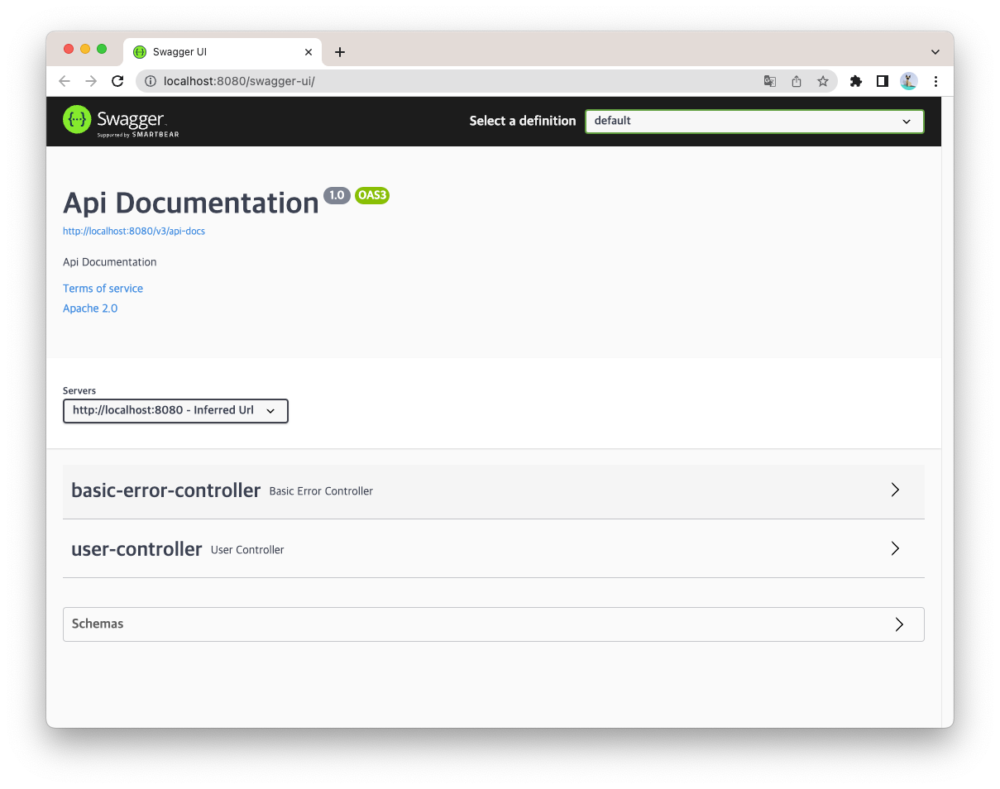

# Swagger

Swagger란, Open Api Specification(OAS)를 위한 프레임워크로써 어노테이션을 통해 REST API를 문서화하며, 문서 UI에서 바로 API 테스트를 할 수 있도록 지원해준다.

### 의존성 추가

```groovy
dependencies {
    //swagger
    implementation("io.springfox:springfox-boot-starter:3.0.0")
}
```

Spring Boot 2.6 이상부터는 다음과 같은 오류가 발생할 수 있다.
```
org.springframework.context.ApplicationContextException: Failed to start bean 'documentationPluginsBootstrapper'; nested exception is java.lang.NullPointerException: Cannot invoke "org.springframework.web.servlet.mvc.condition.PatternsRequestCondition.getPatterns()" because "this.condition" is null
```
이를 해결하기 위해서는 `application.yml` 에 다음을 추가하자.
```yaml
spring:
  mvc:
    path match:
      matching-strategy: ant_path_matcher
```

### Swagger ui

`~/swagger-ui/` 로 접속하면 화면이 나온다. (ex. http://localhost:8080/swagger-ui/)



### Swagger 사용법
- `@ApiOperation` : 특정 path에 대한 설명.
- `@ApiResponses`, `@ApiResponse` : operation의 응답에 대한 설명. 응답 코드, 메시지, 응답 클래스, 예시 제공.
- `@ApiModel` : 모델에 대한 정보. 이름, 설명, 부모 클래스 제공.
- `@ApiModelProperty` : 모델 프로퍼티에 대한 설명. 설명, 데이터 타입, 필수 여부, 예시 제공. 


<br/>

> 🔖 [공식 문서](https://springfox.github.io/springfox/docs/current/)
